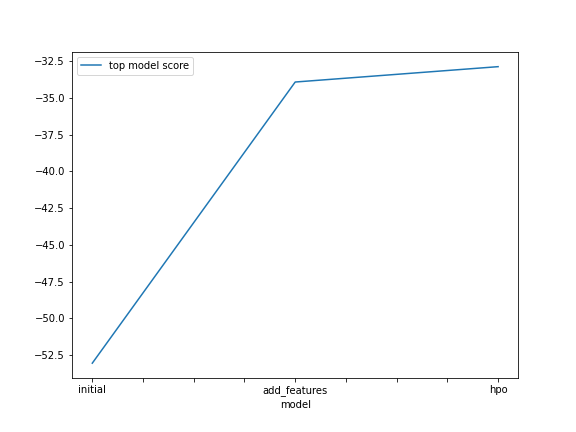
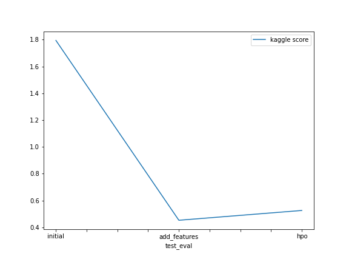

# Report: Predict Bike Sharing Demand with AutoGluon Solution
#### Priyam Saha

## Initial Training
### What did you realize when you tried to submit your predictions? What changes were needed to the output of the predictor to submit your results?

When I tried to code my project first in my local machine, I was facing a lot of errors and thereafter, I decided to use the SageMaker Studio itself. I executed this task twice and got scores of 1.79011 and 1.79407 . Obviously this model performed bad and needed some improvements.

### What was the top ranked model that performed?
My top ranked model is the add_features model(second model) . This model was implemented by adding some additional features to the initial model but it had no tuning autogluon hyperparameters (the third model).  The score obtained was about - 0.44972 (first try) and 0.45253 (second try) .

## Exploratory data analysis and feature creation
### What did the exploratory analysis find and how did you add additional features?
From the histogram plots during exploratory data analysis, I found out that---

The feature "season" was almost uniformly distributed while the temperature features like "temp" and "atemp" were normally distributed. "humidity" was a bit left-skewed and "windspeed" was right-skewed.

The features like "season" and "weather" are categorical in nature though they have been considered as int type. So their datatypes were changed to categorical.

The features like "casual" and "registered" are irrelevant in our model as they are absent in the test dataset and hence have beeen ignored.

Since demand varies on an hourly basis during each day, So the 'datetime' feature was splitted into year, month, day (dayofweek) and hour respectively. Subsequently, 'datetime' featured was ignored while training along with the 'casual' and 'weather' features.

### How much better did your model preform after adding additional features and why do you think that is?

When these additional features were added to the datasets, the model improved by a huge margin. The initial model score was 1.79407 which improved to about 0.45253 which is an improvement of about 75%. The main reason for the improvement was the conversion of the integer datatypes (season and weather) into their actual categorical types and the splitting of the "datetime" feature into independent features like "day", "month', "year" and "hour".

## Hyper parameter tuning
### How much better did your model preform after trying different hyper parameters?
The model definitly performed better than the initial model with no tuning and no added features (improvement of about 70.7%) but performed worse than the second model with only the additional features. The second model performed better than the third marginally by about 16%.

### If you were given more time with this dataset, where do you think you would spend more time?
Given more time, I think I would spend more time going through the documentations to figure out the impact of the different hyperparameters on the model. Maybe, I would try to experiment with some more additional features in order to improve my score further.

### Create a table with the models you ran, the hyperparameters modified, and the kaggle score.
|model|hpo1|hpo2|hpo3|score|
|--|--|--|--|--|
|initial|"root_mean_squared_error"|"best_quality"|'problem_type = "regression"'|1.79407|
|add_features|"root_mean_squared_error"|"best_quality"|'problem_type = "regression"'|0.45253|
|hpo|"root_mean_squared_error"|"best_quality"|"tabular autogluon"|0.52558|

### Create a line plot showing the top model score for the three (or more) training runs during the project.

### Create a line plot showing the top kaggle score for the three (or more) prediction submissions during the project.

## Summary
TODO: Add your explanation
